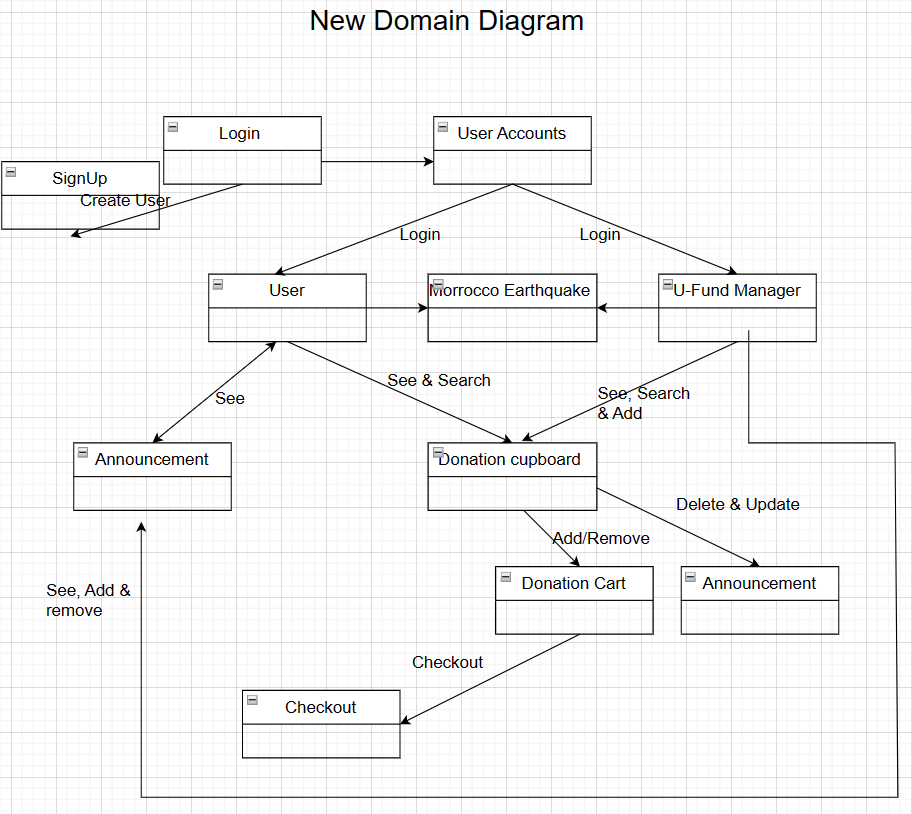
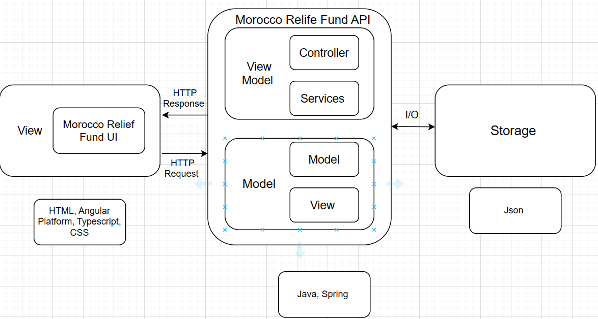
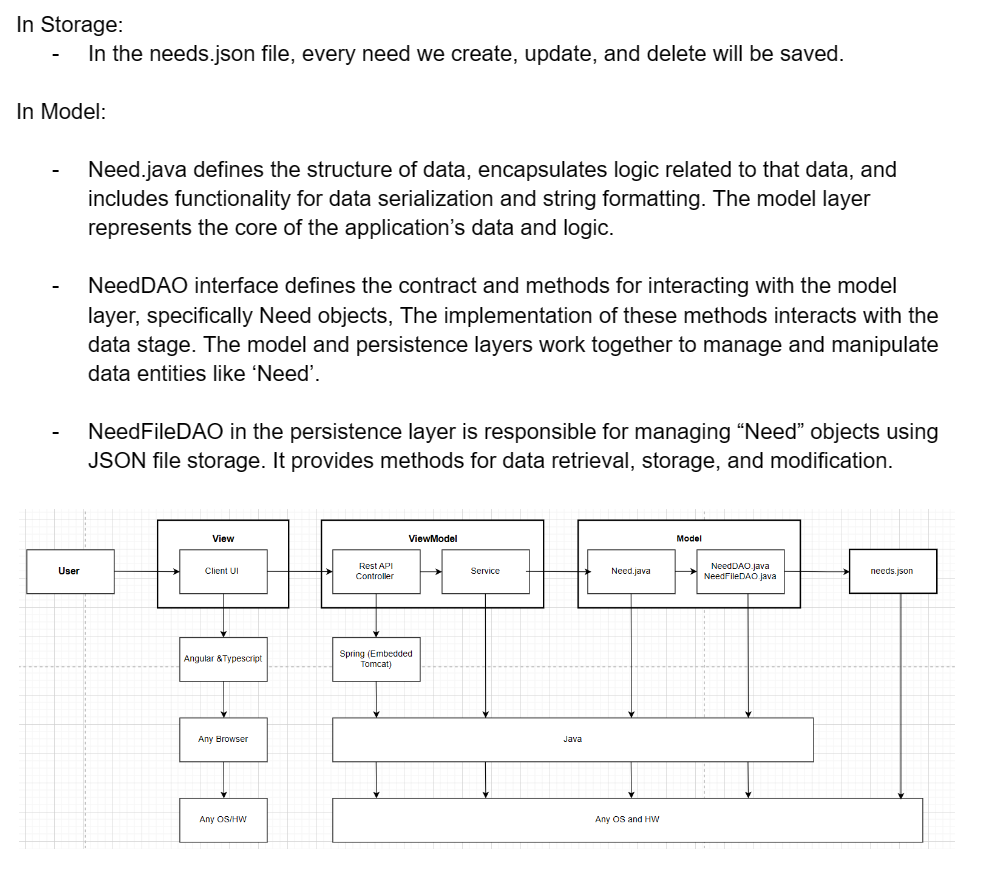
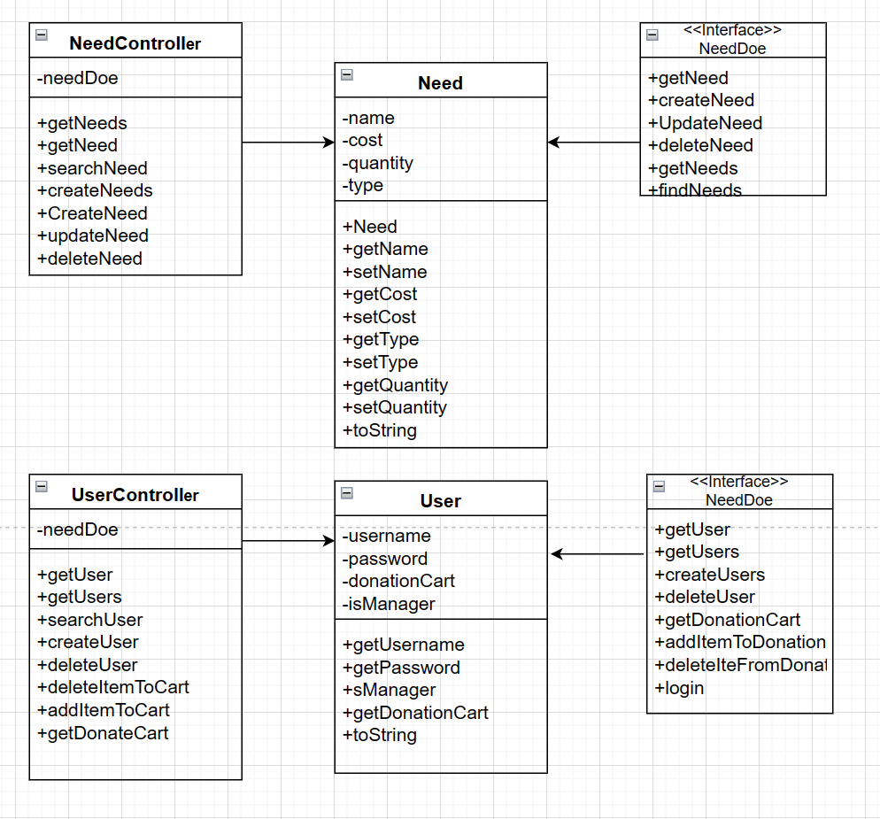
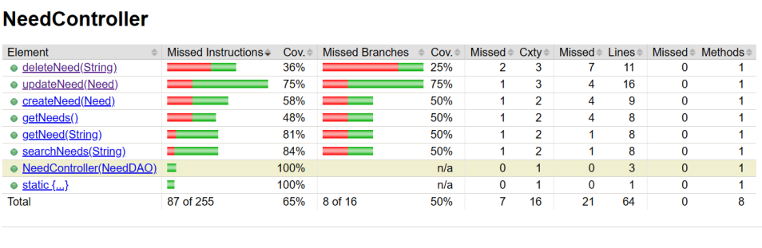
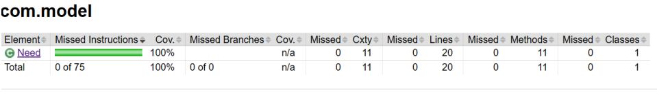
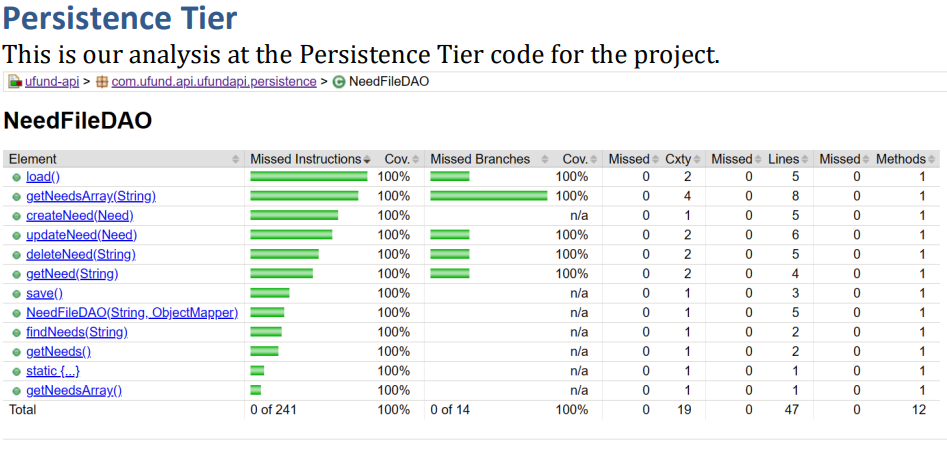
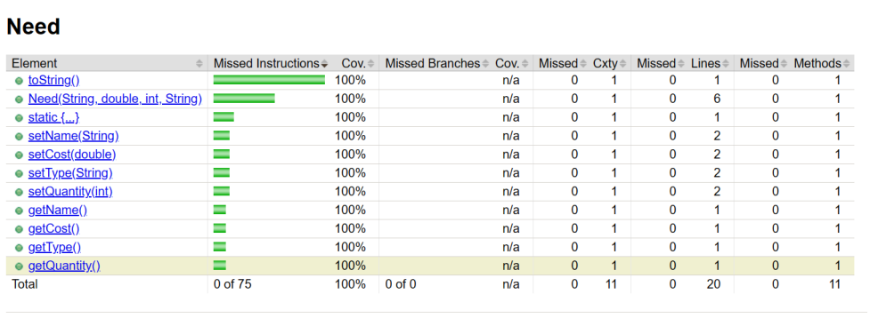

# PROJECT Design Documentation

> _The following template provides the headings for your Design
> Documentation.  As you edit each section make sure you remove these
> commentary 'blockquotes'; the lines that start with a > character
> and appear in the generated PDF in italics._

## Team Information
Team name: Teamftw, team07
* Team members
* Gonzalo Estrella
* Abel Girma
* Ansley Orell
* Aniruddha Roy

## Executive Summary

This is a summary of the project. FundMorocco is a relief fund site dedicated to transferring funds to Morocco following the recent earthquake. We aim to provide a platform that allows anyone to easily view available resources and donate to Morocco.

### Purpose
Our purpose is to enable users (helpers) to donate goods to Morocco. They can do this by purchasing goods from our site, which will then be directly shipped to Morocco, or by directly donating money.

### Glossary and Acronyms

| Term          | Definition |
|------         |------------|
| SPA           | Single Page |
| Helper        | A person who logs in with the intention to donating|
| Admin         | A person who logs in with the admin username and upkeeps the website |
| Donation cart | A collection of goods chosen by a user for them to pay at the checkout|
| Need          | The goods which are sold in the store |
| 10% feature   | Single Page |
| DAO           | Data Access Object, within the persistence tier |
| HTTP          | HyperText Transfer Protocol, a network protocol for specifications on how data should be transferred |
| CSS           | Cascading Style Spreadsheets that describe how HTML elements are to be displayed on screen |
| UI            | View section of the project to be shown to the user |
| API           | Application Programming Interface, connection interface between computers or computer programs |
| MVP           | Minimum Viable Product |

## Requirements

FundMorocco allows user creation through signup and will display an error message if the provided username is already in use. Users can log in using a username, with "admin" reserved for the site owner. This controls access to two main pages: the helper browse page and the admin browse page.

User Features:
Users can view a list of goods in the inventory.
This inventory can be filtered by the maximum amount available, updating the display to show only products below the user-defined threshold.
Live updates are possible through a good search, showing only goods that contain the user-defined search term.
Users can click on any product to access its detail page.
Users can view, add to, and remove items from their donation cart.
The donation cart allows users to see their selected goods and proceed to checkout to finalize their donation.
Users can navigate between the Login, Browse, and Donation Cart pages at any time.

Admin Features:
The admin can view the inventory, search for specific goods, and add new goods listings on their browse page.
Clicking on a specific product listing redirects the admin to the good's detail page, where they can update its price and quantity.

### Definition of MVP
The minimum viable product includes:

Login and logout functionality for Administrators and Customers.
Functionalities such as searching for goods, adding goods to the donation cart, and checking out.
Inventory management, which allows the site owner to add, remove, and update goods in the inventory.
Data persistence, ensuring that the inventory, users, and user shopping carts are saved.

### MVP Features
>  _**[Sprint 4]** Provide a list of top-level Epics and/or Stories of the MVP._

### Enhancements
> _**[Sprint 4]** Describe what enhancements you have implemented for the project._

## Application Domain

This section describes the application domain.

> _**[Sprint 2 & 4]**

FundMorocco's primary domain entity revolves around its users, which are categorized into regular users and an admin, termed as the "U-Fund Manager". Regular users access the platform to view the list of goods available for donation to aid the Morocco Earthquake relief efforts. They can add these goods to their "Funding Basket" and eventually finalize their donation through a checkout process. In addition, users can communicate via email and track the needs related to the earthquake relief. The U-Fund Manager, on the other hand, oversees the "Donation Cupboard" which houses all donated items. The manager can add, remove, or modify the list of goods in the inventory, ensuring the platform stays updated with available relief items. Communication is integral, with email mechanisms in place to facilitate updates and notifications between users and the admin.

> can discuss the more important domain entities and their relationship
> to each other._

## Architecture and Design

This section describes the application architecture.

### Summary

The following Tiers/Layers model shows a high-level view of the webapp's architecture. 

Our application is comprised of three primary components: the view, the MoroccoReliefFund API, and the storage. The MoroccoReliefFund UI, part of the view component, is developed with HTML, CSS, and TypeScript using the Angular framework. The view component is responsible for sending HTTP requests to the eStore API, which then returns HTTP responses. Within the eStore API component, we have the view model and the model. The controller and services, both written in Java, are located in the view model. The controller additionally utilizes the Spring framework. The model comprises our persistence layer and our application model, also written in Java. The eStore API interfaces with the storage through I/O operations. The storage itself consists of JSON files.

The web application, is built using the Model–View–ViewModel (MVVM) architecture pattern.

The Model stores the application data objects including any functionality to provide persistance.

The View is the client-side SPA built with Angular utilizing HTML, CSS and TypeScript. The ViewModel provides RESTful APIs to the client (View) as well as any logic required to manipulate the data objects from the Model.

Both the ViewModel and Model are built using Java and Spring Framework. Details of the components within these tiers are supplied below.

### Overview of User Interface

This section describes the web interface flow; this is how the user views and interacts with the web application.

When a user first opens the application, they are presented with the login page. Here, they have the choice to either log in or create an account. If they opt for the sign-up option, they are redirected to a page that prompts them for a username. They can either proceed to create their account or cancel. Choosing "Cancel" redirects the user back to the login page. If they choose "Create Account", the system will establish a new account with the specified username, log them in, and navigate them to the browse page. However, if an account with that username already exists, the user will be notified of the duplication.

When a user inputs an existing username (other than "admin") on the login page and selects the login option, they are granted access to the application and taken to the browse page. Here, they view the inventory of goods, displayed below a menu bar with options like "Login", "Browse", and "Donation Cart". There's also a search bar to find goods by name. Selecting a specific item redirects the user to a detailed page about that good, where they have the option to add it to their cart. If they select the "Donation Cart" from the menu, they can view the items currently in their cart.

However, if the user enters the username "admin" on the login page, they are directed to the admin-browse page. Here, they can view, add, or remove items from the inventory. Selecting a specific item leads them to the admin-good-detail page, allowing them to modify the item's information.

### View Tier
> _**[Sprint 4]** Provide a summary of the View Tier UI of your architecture.
> Describe the types of components in the tier and describe their
> responsibilities.  This should be a narrative description, i.e. it has
> a flow or "story line" that the reader can follow._

> _**[Sprint 4]** You must  provide at least **2 sequence diagrams** as is relevant to a particular aspects
> of the design that you are describing.  (**For example**, in a shopping experience application you might create a
> sequence diagram of a customer searching for an item and adding to their cart.)
> As these can span multiple tiers, be sure to include an relevant HTTP requests from the client-side to the server-side
> to help illustrate the end-to-end flow._

> _**[Sprint 4]** To adequately show your system, you will need to present the **class diagrams** where relevant in your design. Some additional tips:_
 >* _Class diagrams only apply to the **ViewModel** and **Model** Tier_
>* _A single class diagram of the entire system will not be effective. You may start with one, but will be need to break it down into smaller sections to account for requirements of each of the Tier static models below._
 >* _Correct labeling of relationships with proper notation for the relationship type, multiplicities, and navigation information will be important._
 >* _Include other details such as attributes and method signatures that you think are needed to support the level of detail in your discussion._

### ViewModel Tier
> _**[Sprint 4]** Provide a summary of this tier of your architecture. This
> section will follow the same instructions that are given for the View
> Tier above._

> _At appropriate places as part of this narrative provide **one** or more updated and **properly labeled**
> static models (UML class diagrams) with some details such as critical attributes and methods._
>

### Model Tier
> _**[Sprint 2, 3 & 4]** Provide a summary of this tier of your architecture. This
> section will follow the same instructions that are given for the View
> Tier above._

> _At appropriate places as part of this narrative provide **one** or more updated and **properly labeled**
> static models (UML class diagrams) with some details such as critical attributes and methods._
>

## OO Design Principles
> _**[Sprint 2, 3 & 4]** Will eventually address upto **4 key OO Principles** in your final design. Follow guidance in augmenting those completed in previous Sprints as indicated to you by instructor. Be sure to include any diagrams (or clearly refer to ones elsewhere in your Tier sections above) to support your claims._

> _**[Sprint 3 & 4]** OO Design Principles should span across **all tiers.**_

## Static Code Analysis/Future Design Improvements
> _**[Sprint 4]** With the results from the Static Code Analysis exercise,
> **Identify 3-4** areas within your code that have been flagged by the Static Code
> Analysis Tool (SonarQube) and provide your analysis and recommendations.
> Include any relevant screenshot(s) with each area._

> _**[Sprint 4]** Discuss **future** refactoring and other design improvements your team would explore if the team had additional time._

## Testing
> _This section will provide information about the testing performed
> and the results of the testing._

### Acceptance Testing
> _**[Sprint 2 & 4]** Report on the number of user stories that have passed all their

> acceptance criteria tests, the number that have some acceptance

> criteria tests failing, and the number of user stories that

> have not had any testing yet. Highlight the issues found during

> acceptance testing and if there are any concerns.

15/15 user stories passed all their acceptance criteria tests. 25/31 acceptance criteria tests have passed - at a high code coverage - at least 90% overall.

### Unit Testing and Code Coverage
> _**[Sprint 4]** Discuss your unit testing strategy. Report on the code coverage
> achieved from unit testing of the code base. Discuss the team's
> coverage targets, why you selected those values, and how well your
> code coverage met your targets._

>_**[Sprint 2 & 4]** **Include images of your code coverage report.** If there are any anomalies, discuss
> those._

We can see from the unit test above we have not tested all limits of the code, 
because of this the team will continue working on the tests to be able to check 
and test all aspects of the different function such as the update need which is 
missing 25%. In the Need Controller class, we must implement tests that check 
exceptions.

The unit tests for this component are good because the unit 
tests we implemented for this class cover a wide variety of 
tests. The unit tests created for this class evaluate if the Need 
class correctly formats into a string and if the setters and 
getters for each attribute works.

The code coverage for this component is good because the unit 
tests we implemented for this class cover a wide variety of 
tests. The unit tests created for this NeedFileDAO class 
evaluate if the persistence tier correctly formats into a string. 
Also, it checks if the setters, getters, updateNeed, createNeed
and deleteNeed function correctly.

The unit tests for this component are good because the unit 
tests we implemented for this class cover a wide variety of 
tests. The unit tests created for this class evaluate if the Need 
class correctly formats into a string and if the setters and 
getters for each attribute works.
